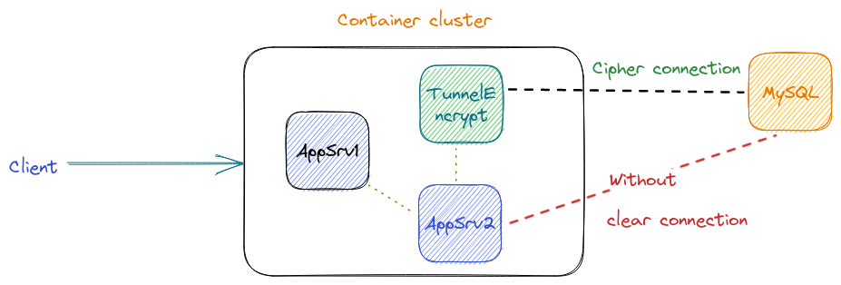

Cotuc
===============

# Summary
Modificación para funcionar por medio de [chainguard](https://www.chainguard.dev/), de esta manera se minimiza el riesgo al tener una imagen que cuenta con soporte para SBOM, minimal footprint y firmadas



You can connect:
 * Apache
 * Nginx
 * MySQL => requiere modificación previa
 * Mongo
 * SSH => requiere modificación previa
 * FTP
 * maybe any service by port

# Ejemplo de configuracion haproxy layer 7-4

```
frontend frontend
   bind ip:port
   mode tcp
   default_backend backend
   
backend backend
   mode tcp
   balance source
   server back01 ip-remote:port check check-ssl verify none

```